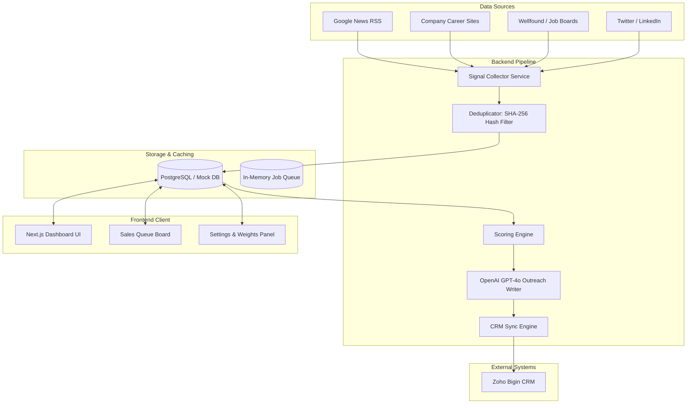

# Away Intelligence: System Design Specification
**A B2B Intent-Driven Coworking Lead Generation Platform**

---

## 1. Product Brief
Away Center operates premium coworking spaces across multiple Indian metro cities (e.g., Bangalore, Vizag, Kolkata). Historically, sales representatives have relied on cold-calling and outbound prospecting, yielding a low conversion rate of ~2%.

**Away Intelligence** is an automated pipeline and dashboard designed to discover, score, and transition high-intent workspace buyers. By monitoring public indicators of local corporate growth—such as hiring sprees, funding rounds, news reports of office expansion, and social posts—the platform calculates real-time intent scores. It automatically qualifies top targets, generates tailored outreach drafts using generative AI, and pipes them directly into the sales team's CRM.

---

## 2. Ideal Customer Profile (ICP) & Scoring Logic

### Ideal Customer Profile
* **Geography:** Companies with active operations or clear expansion plans in Bangalore, Vizag, or Kolkata.
* **Company Size:** Startups and enterprises scaling headcount (50 to 5,000+ employees).
* **Industry Sector:** Technology, Fintech, SaaS, E-commerce, and Professional Services.
* **Signal Profile:** Businesses posting local job listings, celebrating recent venture capital financing, or announcing physical geographic expansions.

### Scoring Logic
Leads are evaluated on a 0-100 scale based on three main dimensions:
$$\text{Overall Score} = (w_{\text{fit}} \times \text{Fit}) + (w_{\text{intent}} \times \text{Intent}) + (w_{\text{timing}} \times \text{Timing})$$

1. **Fit Score (30% weight):**
   * Computes the alignment of the company size and industry. 
   * Prefers organizations of 100-2,000 employees. 
   * Matches company headquarters or target expansion cities against active Away Center locations.
2. **Intent Score (40% weight):**
   * Based on the number and quality of detected signals. 
   * High-weight signals include hiring for administrative, facilities, or HR management roles (indicating office setups) and geographic office expansion announcements.
3. **Timing Score (30% weight):**
   * Measures signal recency using an exponential decay model.
   * Recent events (within 7–14 days) receive the maximum score, decaying gradually to zero over a 90-day window.

*If the **Overall Score exceeds 75**, the company is classified for **Immediate Outreach** and auto-synced to the CRM.*

---

## 3. System Architecture Diagram



---

## 4. Data Source Plan

| Data Source | Type | Extraction Technique | Frequency | Cost |
|---|---|---|---|---|
| **Google News RSS** | RSS / XML | HTTP fetch and XML regex extraction | Every 6 hours | Free |
| **Career Portals** | Web Scrapes | Headless Playwright / HTML regex crawler | Daily | Free |
| **Wellfound Jobs** | Job Feed | REST API query / scraping | Daily | Free |
| **Crunchbase API** | Funding | Direct API query / Public databases | Weekly | Free |

---

## 5. Database Schema

The system uses a relational database schema designed to support tracking companies, signals, scores, contacts, and CRM synchronization status.

```sql
-- Companies Table
CREATE TABLE companies (
    id UUID PRIMARY KEY DEFAULT gen_random_uuid(),
    name VARCHAR(255) NOT NULL,
    normalized_name VARCHAR(255) UNIQUE,
    website VARCHAR(512),
    linkedin_url VARCHAR(512),
    industry VARCHAR(100),
    employee_count INT,
    city VARCHAR(100),
    country VARCHAR(100),
    funding_stage VARCHAR(100),
    latest_funding_date DATE,
    estimated_budget NUMERIC,
    is_active BOOLEAN DEFAULT TRUE,
    is_remote_only BOOLEAN DEFAULT FALSE,
    is_staffing_agency BOOLEAN DEFAULT FALSE,
    created_at TIMESTAMP DEFAULT CURRENT_TIMESTAMP,
    updated_at TIMESTAMP DEFAULT CURRENT_TIMESTAMP
);

-- Signals Table
CREATE TABLE signals (
    id UUID PRIMARY KEY DEFAULT gen_random_uuid(),
    company_id UUID REFERENCES companies(id) ON DELETE CASCADE,
    signal_type VARCHAR(50) NOT NULL, -- 'HIRING_SIGNAL', 'FUNDING_SIGNAL', etc.
    signal_source VARCHAR(50) NOT NULL, -- 'career_page', 'news_api', etc.
    signal_text TEXT NOT NULL,
    signal_date DATE NOT NULL,
    confidence_score INT NOT NULL,
    is_duplicate BOOLEAN DEFAULT FALSE,
    is_active BOOLEAN DEFAULT TRUE,
    raw_payload JSONB,
    created_at TIMESTAMP DEFAULT CURRENT_TIMESTAMP
);

-- Scores Table
CREATE TABLE scores (
    id UUID PRIMARY KEY DEFAULT gen_random_uuid(),
    company_id UUID REFERENCES companies(id) ON DELETE CASCADE UNIQUE,
    fit_score INT NOT NULL DEFAULT 0,
    intent_score INT NOT NULL DEFAULT 0,
    timing_score INT NOT NULL DEFAULT 0,
    overall_score INT NOT NULL DEFAULT 0,
    score_reasoning TEXT,
    updated_at TIMESTAMP DEFAULT CURRENT_TIMESTAMP
);

-- Contacts Table
CREATE TABLE contacts (
    id UUID PRIMARY KEY DEFAULT gen_random_uuid(),
    company_id UUID REFERENCES companies(id) ON DELETE CASCADE,
    name VARCHAR(255) NOT NULL,
    title VARCHAR(100),
    linkedin_url VARCHAR(512),
    email VARCHAR(255),
    seniority VARCHAR(50),
    decision_maker BOOLEAN DEFAULT FALSE,
    created_at TIMESTAMP DEFAULT CURRENT_TIMESTAMP
);

-- CRM Sync Records
CREATE TABLE crm_records (
    id UUID PRIMARY KEY DEFAULT gen_random_uuid(),
    company_id UUID REFERENCES companies(id) ON DELETE CASCADE UNIQUE,
    zoho_lead_id VARCHAR(100),
    status VARCHAR(50) NOT NULL DEFAULT 'pending', -- 'pending', 'synced', 'failed'
    assigned_salesperson VARCHAR(255),
    last_updated TIMESTAMP DEFAULT CURRENT_TIMESTAMP,
    retry_count INT DEFAULT 0,
    last_error TEXT
);

-- Outreach Recommendations
CREATE TABLE outreach_recommendations (
    id UUID PRIMARY KEY DEFAULT gen_random_uuid(),
    company_id UUID REFERENCES companies(id) ON DELETE CASCADE UNIQUE,
    recommended_product VARCHAR(100) NOT NULL,
    outreach_angle TEXT,
    subject TEXT,
    personalization TEXT,
    pain_point TEXT,
    cta TEXT,
    ai_confidence INT DEFAULT 70,
    requires_human_review BOOLEAN DEFAULT FALSE,
    created_at TIMESTAMP DEFAULT CURRENT_TIMESTAMP
);
```

---

## 6. MVP Design

The frontend is built using Next.js 15, styled with Vanilla CSS, featuring:
* **Interactive Dashboard:** Core KPIs (leads, signals, qualified accounts) and data charts display high-level health metrics.
* **Prioritized Sales Queue:** A card board categorizing leads by priority status (`Immediate Outreach`, `Nurture`, `Manual Review`, `Ignored`).
* **Company Profile Explorer:** Visualizes a single company's score breakdown, chronological signal timeline, AI-generated email pitch, and an active panel to add and sync contacts.
* **Control Center:** Sliders to customize scoring weights and a form to modify background crawler schedules.

---

## 7. 90-Day Roadmap

```
  Days 1-30: Core Scrapers & Scoring (Completed)
  ├─ Implement Google News RSS & Playwright scrapers
  ├─ Design three-dimensional scoring system (Fit, Intent, Timing)
  └─ Build Next.js Dashboard and Sales Queue interface

  Days 31-60: Integrations & Live CRM
  ├─ Implement Zoho CRM OAuth handshake
  ├─ Configure real-time Slack/Teams alert notifications
  └─ Add audit logs UI and scheduler execution tracking

  Days 61-90: Scale & Automation
  ├─ Launch automated cold-email outbound sequences
  ├─ Integrate proxy rotation for web crawlers
  └─ Expand target coverage to 3 new cities
```

---

## 8. CRM Integration Plan (Zoho Bigin)
1. **Authentication:** Authenticate via Zoho OAuth 2.0 with offline access tokens stored securely.
2. **Lead Mapping:**
   * `Company Name` $\rightarrow$ Zoho Account Name
   * `Website` $\rightarrow$ Zoho Account Website
   * `Recommended Product` $\rightarrow$ Custom CRM field
   * `AI Personalization & Draft` $\rightarrow$ Description / Note
3. **Automated Sync:** A daily cron job finds companies marked `pending` in `crm_records` with an `overall_score >= 75` and posts them to the Zoho API. On success, state updates to `synced`.

---

## 9. Cost Estimate (Under $150 / month)

* **Database & Hosting (Render / Heroku):**
  * Express API Server & Worker Host: $14/month
  * Managed PostgreSQL: $15/month
  * Upstash Redis (Serverless): Free / $10/month
* **APIs:**
  * OpenAI API (GPT-4o calls for outreach): ~$25/month (based on volume)
  * News API & RSS: $0/month
  * Vercel (Frontend Hosting): Free (Hobby tier)
* **Total Estimated Cost:** **~$64/month**

---

## 10. Build-versus-Buy Recommendation
We recommend **building** this platform custom. 

* **Why standard tools fail:** Off-the-shelf databases (like Apollo, ZoomInfo, or Lusha) provide static firmographic lists, but they do not calculate custom real estate intent scores nor do they provide automated workspace product recommendations (e.g., matching hiring patterns to Private Offices vs. Day Passes).
* **Speed to value:** A custom build can be quickly tailored to Away Center's specific business definitions and local Indian cities.

---

## 11. Risks & Compliance
* **Web Scraping Rate Limits:** Target career sites may block scrapers. *Mitigation:* We use a lightweight HTTP regex fallback when Playwright browser launch is blocked or fails, and enforce random sleep delays between page requests.
* **GDPR & CAN-SPAM Compliance:** Reaching out to personal business emails requires consent or legitimate interest. *Mitigation:* Personalization draft includes a clear "opt-out" clause, and email triggers remain manual/opt-in for the sales representative during the MVP phase.

---

## 12. Working Prototype Details
The application has been fully developed locally. For Vercel deployments, a high-fidelity **client-side/server-side mock fallback** is embedded. If the frontend cannot communicate with the database/API server, it falls back to a 17-company database, allowing you to demonstrate the full application (searching, company profiles, adding contacts, changing settings, and CRM syncing) directly from the Vercel web interface.
