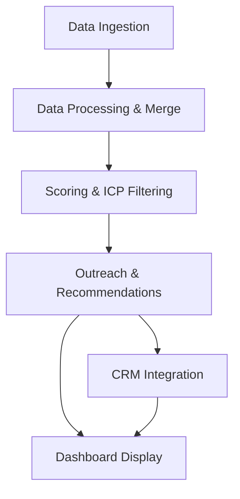
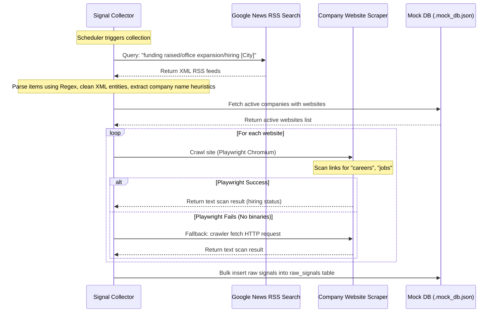
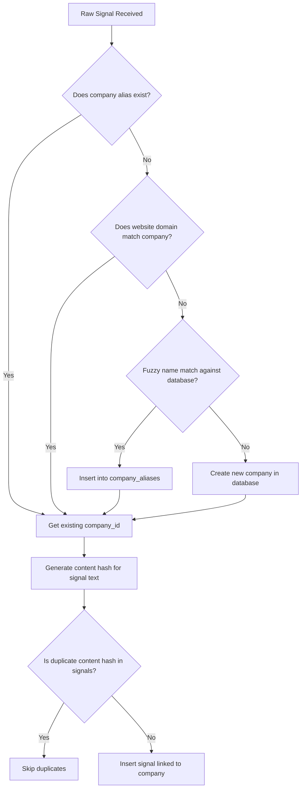
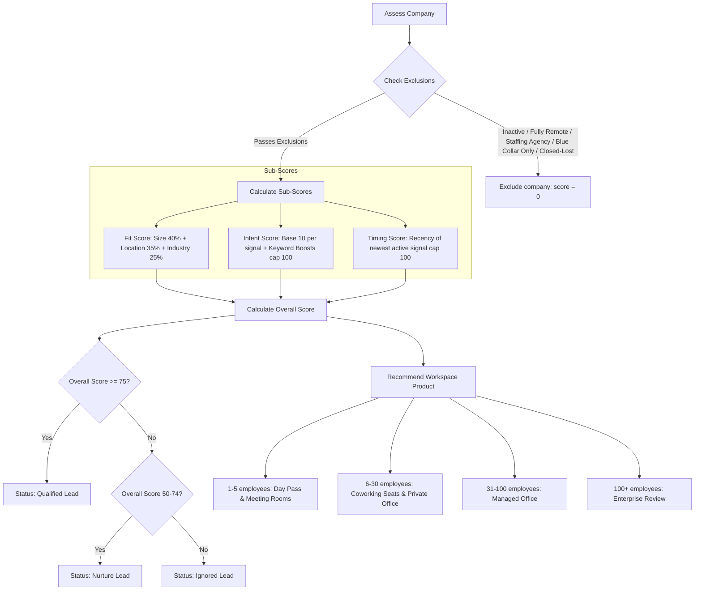
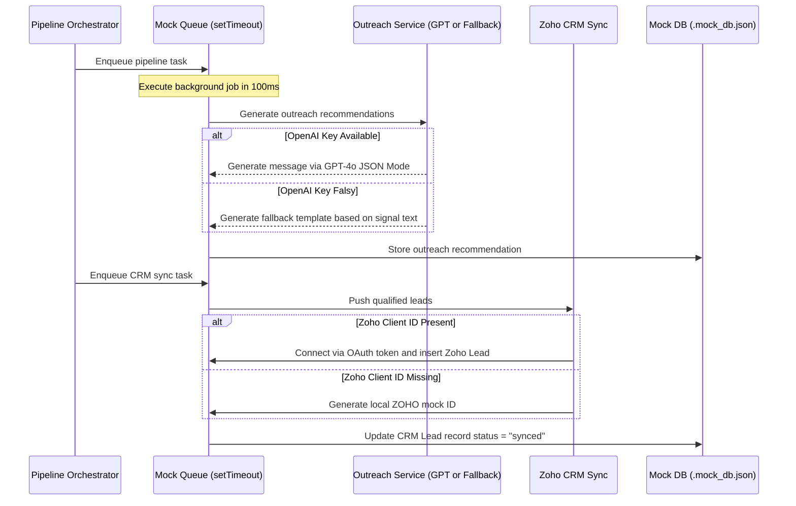

# System Workflow: Away Intelligence

This document details the end-to-end technical workflow of the **Away Intelligence** application, describing how signals are discovered, companies are scored, recommendations are generated, and data is prioritized on the sales dashboard.

---

## 1. High-Level Data Flow

---

## 2. Ingestion & Scraper Workflow

The signal collection runs on a scheduler or manual trigger. It combines mock lists with real-world live scrapers.

---

## 3. Data Processing & Deduplication

Signals are normalized and companies are merged before scoring.

---

## 4. Scoring & Product Recommendation Engine

The scoring engine ranks companies using configurable weights (`SCORING_FIT_WEIGHT`, `SCORING_INTENT_WEIGHT`, `SCORING_TIMING_WEIGHT`).

---

## 5. Queue & CRM Integration Workflow

Qualified leads (`overall_score >= 75`) trigger asynchronous background tasks.

---

## 6. Dashboard Flow (Frontend Layout)

* **`/` (Dashboard Summary)**: Exposes total metrics (High Intent count, New Signals, Conversion Rates), top cities, and a quick list of top-scored companies.
* **`/leads` (Leads Explorer)**: Provides paginated list of companies with advanced filtering (city, industry, score range, signal types).
* **`/companies/[id]` (Details Page)**: Displays company details, signal history, contacts, CRM log, and AI-generated outreach copy.
* **`/sales-queue` (Outreach Board)**: Splits sales reps' action tasks into **Immediate Outreach**, **Manual Review**, or **Nurture**.
* **`/signals` (Signal Feed)**: Feeds chronological signal notifications.
